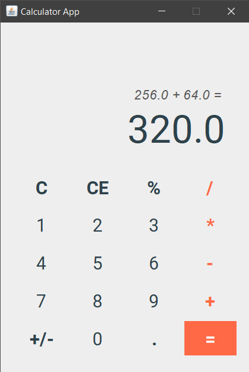

# Simple Calculator App

A simple calculator app with GUI. It allows to perform basic arithmetic operations and view their calculation history.

## Usage
Compile and run code:
```
cd src
javac *.java
java CalculatorApp
```
## Demo



## Notes
- Only supports basic arithmetic operations but does not handle complex mathematical functions.
- Limited precision for decimal calculations.
